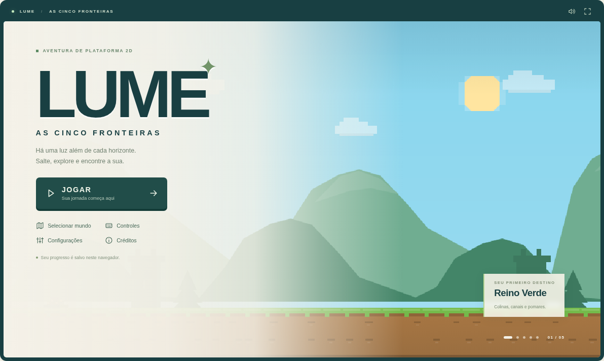
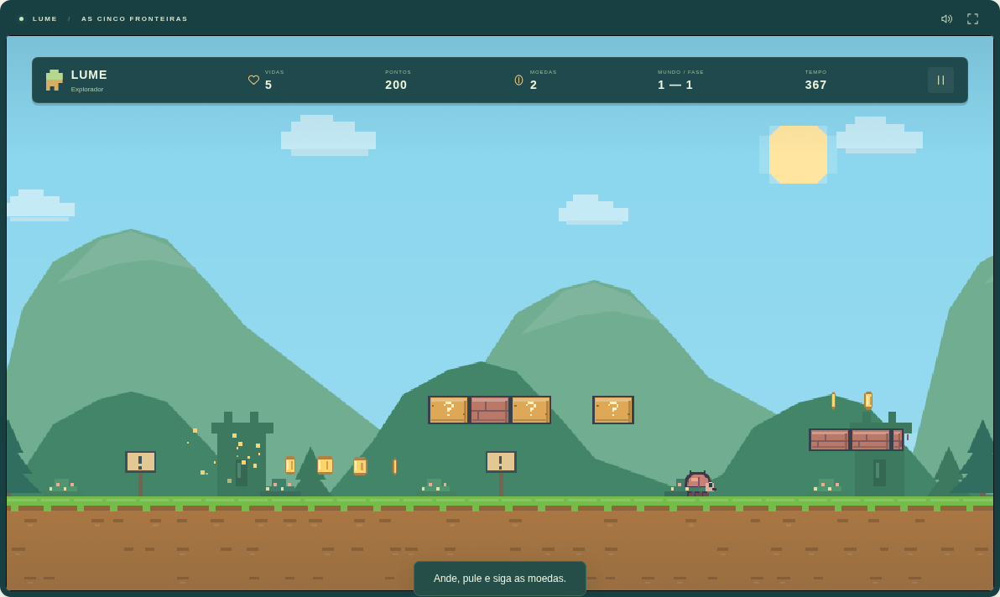

# Lume — As Cinco Fronteiras

Uma aventura de plataforma 2D para navegador com **cinco mundos, quinze fases e cinco guardiões**. Lume atravessa canais, ruínas, gelo, copas luminosas e pontes de lava para encontrar a luz além de cada horizonte.

O projeto nasceu da referência visual do vídeo “Super Mario CSS” enviado pelo autor: câmera lateral, saltos, blocos, moedas e canos. A [análise do vídeo](docs/ANALISE-VIDEO.md) distingue o que foi observado do que não pode ser confirmado pela gravação. A campanha, controles e sistemas foram implementados neste repositório.

Projeto independente, **não oficial e sem vínculo com a Nintendo**. Personagem, cenários, inimigos, ícone, músicas e efeitos são originais e produzidos por código; não há sprites, gravações ou músicas proprietárias copiadas.





## Jogabilidade

- Movimento com aceleração, desaceleração, controle no ar, salto variável, tolerância após sair da borda (_coyote time_) e antecipação do salto (_jump buffering_).
- Física em passos de 1/120 s, colisões com chão, paredes e teto; menor atrito no gelo.
- Moedas, blocos com recompensas, tijolos quebráveis quando fortalecido, blocos ocultos, plataformas móveis e plataformas frágeis que reaparecem.
- Canos de ida e volta para salas secretas, rotas altas, checkpoints, bandeira de chegada e dificuldade progressiva.
- Inimigos terrestres, cascos, voadores, sentinelas que disparam, blindados e guardiões. Casco deslizante atinge outros inimigos.
- Crescimento absorve um golpe; flor de fogo dispara com J; estrela protege por 12 segundos; coração concede uma vida. Água, lava e quedas custam uma vida mesmo com estrela.
- Cinco vidas iniciais, bônus de tempo, pontuação, 100 moedas para vida extra, pausa, derrota e vitória. A próxima fase preserva vidas e pontuação da campanha.
- Mapa com desbloqueios, recorde por fase, relíquias e nove conquistas. Cada fase conta uma marca de relíquia ao encontrar qualquer relíquia dela; existem 29 posições para explorar.
- HUD, músicas e efeitos com volumes independentes, pixel art animada, parallax, clima, água e lava animadas e áudio chiptune original.
- Teclado, gamepad padrão e botões de toque com pressionamentos simultâneos.

## Mundos

| Mundo               | Fases                                                       |
| ------------------- | ----------------------------------------------------------- |
| Reino Verde         | Primeiros Passos · Canais do Vale · Guardião do Pomar       |
| Deserto Dourado     | Dunas ao Vento · Pontes do Cânion · Templo das Areias       |
| Montanhas Geladas   | Lago de Cristal · Escalada Azul · Coração da Nevasca        |
| Floresta Encantada  | Copas Luminosas · Ruínas dos Vagalumes · A Árvore Ancestral |
| Fortaleza Vulcânica | Pontes de Basalto · Fornalha dos Ecos · A Última Chama      |

Os mapas têm entre 3.200 e 5.200 pixels de largura e composições distintas. A terceira fase de cada mundo termina em um guardião. Veja [desenho das fases](docs/FASES.md).

## Controles

| Ação                        | Teclado              | Gamepad padrão                    |
| --------------------------- | -------------------- | --------------------------------- |
| Mover                       | A / D ou ← / →       | Analógico esquerdo / direcional   |
| Pular                       | Espaço, W ou ↑       | A / ✕                             |
| Correr                      | Shift                | X / □ ou gatilho direito          |
| Habilidade de fogo          | J                    | B / ○                             |
| Entrar em cano com passagem | S ou ↓, sobre o cano | Direcional / analógico para baixo |
| Pausar / continuar          | Esc                  | Start / Options                   |

Segure salto para ganhar altura e solte para encurtar o arco. Corra antes dos vãos. Guardiões recebem dano quando baixam a guarda e exibem a abertura luminosa; na segunda metade do combate ficam mais rápidos. Perda de foco pausa automaticamente.

No celular, controles aparecem automaticamente. Podem ser ativados em Configurações no computador. Use dois dedos para mover e saltar; habilidade fica disponível com a flor de fogo. Orientação horizontal e tela cheia dão mais espaço. A versão hospedada funciona sem instalar aplicativo.

## Desenvolver

Requer Node.js 24 (ou >= 22.12). Não há backend, chave de API, banco de dados ou assets externos para executar o jogo. TypeScript e Vite organizam o projeto; Canvas2D renderiza os sprites e Web Audio sintetiza as trilhas.

```bash
npm ci --ignore-scripts
npm run dev
```

Vite usa a base `/Mario/`. Abra esse caminho no endereço local informado no terminal. O servidor aceita conexão pela rede local para testar em outro dispositivo.

No ambiente Codex, use o cache gravável fora do repositório:

```bash
cd /workspace/Mario
export npm_config_cache=/workspace/.npm-cache
npm ci --ignore-scripts
npm run dev
```

Use o checkout existente; não crie outro repositório ou um worktree para configurar o ambiente de nuvem.

## Build e testes

```bash
npm run typecheck
npm test
npm run build
npm run test:e2e
```

`dist/` recebe a versão estática de produção. `npm run preview` serve o build localmente sob `/Mario/`. Para outro nome de repositório, ajuste `vite.config.ts`.

Testes de navegador usam Chromium em `/usr/bin/chromium` no ambiente de nuvem. Para outro executável, defina `CHROMIUM_PATH`. Em CI, o workflow instala e usa o Chromium do Playwright. Em um computador sem Chromium de sistema:

```bash
npx playwright install chromium
CI=1 npm run test:e2e
```

Os testes usam portas 5173 e 4173 para desenvolvimento e produção. Localmente podem reutilizar servidores deste projeto; em CI precisam das portas livres.

A validação registrada inclui **88 testes de lógica e 15 de navegador**: quinze rotas completas com entradas normais, cinco chefes, colisões, interações, poderes, progressão, salvamento, teclado, toque em emulação móvel, áudio, gamepad virtual e produção. Gamepad/aparelho físicos, Firefox e Safari não foram testados. Veja [relatório de validação](docs/VALIDACAO.md).

## Salvamento e recordes

localStorage guarda dados versionados na chave `lume-save-v1`: fases desbloqueadas/concluídas, recordes, marcas de relíquias, conquistas e preferências. Recarregar preserva esses dados. Jogar retoma a próxima fase disponível; partidas interrompidas recomeçam a fase, e checkpoints valem dentro da sessão atual.

JSON inválido ou versão desconhecida inicia dados seguros. Se o navegador negar armazenamento, o jogo continua e avisa que o progresso vale só para aquela sessão. Reiniciar progresso exige confirmação. O mapa apresenta recordes locais por fase; não há conta, ranking online ou sincronização entre dispositivos.

## Arquitetura e novas fases

```text
src/
  core/       simulação, colisões, interações, inimigos, chefes e progressão
  data/       mapas declarativos e paletas dos mundos
  render/     pixel art, cenários, sprites e composição
  systems/    entrada, áudio e salvamento
  ui/         menus, mapa, configurações e HUD
tests/
  unit/       lógica e campanha
  helpers/    jogador automatizado por entradas normais
  browser/   interface, toque e build de produção
```

Adicione uma composição `Level` em `src/data/levels.ts`: ID único, dimensões, spawn, chão, plataformas, moedas, inimigos, perigos, checkpoint e saída. Os tipos estão em `src/core/types.ts`. Spawn, checkpoint e destinos de canos são o canto superior esquerdo do jogador; `exit.y` é a base da bandeira.

Impulso de salto de 590 px/s, gravidade de 1550 px/s² e corrida de 340 px/s. Preserve aterrissagens e evite teto sobre a trajetória obrigatória. Execute testes de rota com inimigos e perigos ativos. Plataformas móveis usam eixo, amplitude e velocidade angular; salas secretas precisam de destino de retorno explícito.

O salvamento atual suporta quinze fases. Para ampliar a campanha, atualize limites/versionamento em `save.ts`, mapa da interface, progressão e testes; adicionar um mapa não exige reescrever a física.

## GitHub Pages

O [workflow pages.yml](.github/workflows/pages.yml) instala com lockfile, testa, compila, valida navegador e publica `dist/` após push para `main`. Também pode ser executado manualmente em Actions. Deploy depende de todos os checks passarem.

Habilite **Settings → Pages → Build and deployment → Source: GitHub Actions**. Actions deve estar habilitado no repositório; aprove o ambiente `github-pages` se houver regra de revisão. Permissões de Pages/OIDC ficam no job de deploy.

**Publicação pública pendente.** O código está em `main`. O job de build passou na [execução remota](https://github.com/Helio965/Mario/actions/runs/37821366667), incluindo todos os testes e o artefato de produção. Pages continua desativado: a integração recusou a criação do site com HTTP 403 (`Resource not accessible by integration`), e o job de deploy falhou em `configure-pages`.

Habilite **Settings → Pages → Source: GitHub Actions**, abra a execução em Actions e escolha **Re-run failed jobs**. Depois de concluir o deploy, use o endereço emitido pelo job e valide o jogo. Não há link apresentado como demonstração funcional antes dessa verificação.

## Créditos e licença

- Repositório e licença MIT original: Hélio.
- Lume, pixel art, cenários, ícone, lógica e composições Web Audio: implementação original, sob a licença MIT deste repositório.
- Referência visual: vídeo enviado de “Super Mario CSS”, analisado sem reutilizar assets.
- Ferramentas de desenvolvimento: TypeScript (Apache-2.0), Vite/Vitest (MIT) e Playwright (Apache-2.0). Nenhuma dependência de runtime é enviada ao jogador.
- Super Mario e Nintendo pertencem a seus titulares. Este jogo não é afiliado ou endossado por eles.

Veja [LICENSE](LICENSE) e [plano técnico](docs/ARQUITETURA.md). Desenvolvimento organizado nas dez etapas solicitadas, com commits separados e validação antes de avançar.
